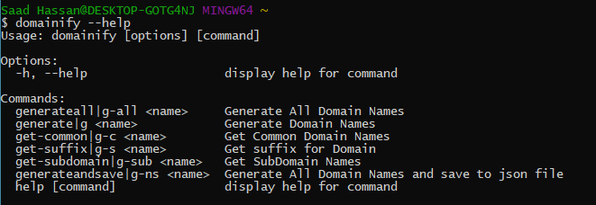
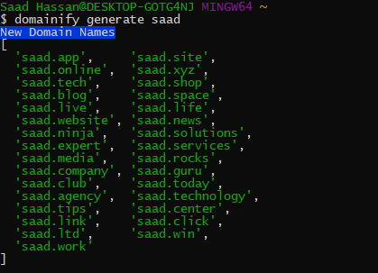

<div align="center">
	<h1>Domain Name Generator Cli<br>
	
	
	
	</h1>
</div>

# Generate Domain Names in different formats for your upcoming website.

[](#)
[](#)
[](https://github.com/saadhaxxan/Covid-19-Dashboard/fork)
[](https://github.com/saadhaxxan/Covid-19-Dashboard/issues)
[](#)


## 👉 FEATURES

- Generate domain names
- Generate common domain names
- Generate All Domain Names (each and every possible)
- Get suffixes for Domain
- Get SubDomain Names
- Generate All Domain Names and save to json file

##  INSTALLATION
### From Npm
```
npm i -g domainify_cli
```
### From Github
```
git clone 
```





## Author
You can get in touch with me on my LinkedIn Profile:

#### Saad Hassan
[](https://www.linkedin.com/in/saadhaxxan)

You can also follow my GitHub Profile to stay updated about my latest projects: [](https://github.com/saadhaxxan)

If you liked the repo then kindly support it by giving it a star ⭐!

If you find any bug in the code or have any improvements in mind then feel free to generate a pull request.
